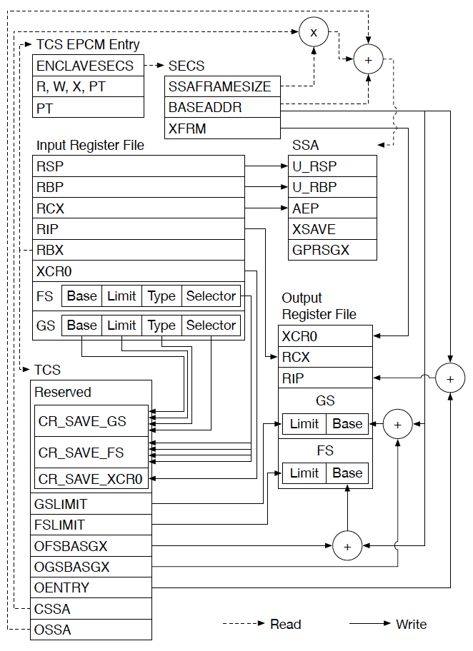

This markdown file mainly talks about process of ecall designed by programmer, we assume that EDMM, switchless ecall are not used, and the beginning function of this process is CEnclave::ecall.
###### CEnclave::ecall(const int proc, const void *ocall_table, void *ms, const bool is_switchless)
Proc is used as the serial number of ecall, ms is parameter of ecall. Firstly, it judges whether the ecall is switchless. In this case, we don't use switchless ecall, so this can be skipped. Then we need to get the trust_thread, which includes information of tcs we need to use in ecall. After that it compares proc with ECMD_UNINIT_ENCLAVE, this can also be skipped. Finally it calls do_ecall in sig_handler.cpp.
###### do_ecall(const int fn, const void *ocall_table, const void *ms, CTrustThread *trust_thread)
Fn is the same as proc in last function, and it gets address of tcs from trust_thread, which is one of parameter for EENTER. Then it calls enter_enclave function.
###### enter_enclave(const tcs_t *tcs, const long fn, const void *ocall_table, const void *ms, CTrustThread *trust_thread)
Enter_enclave is defined as __morestack in enter_enclave.S, and firstly it calls EENTER_PROLOG, saving value of params, non-volatile GPRs and xfeature registers to stack, then it assigns value of fn to rdi, address of ecall parameter to rsi, cleans the upper bits of YMM registers, assigns address of tcs to rbx, assigns address of AEP to rcx, assigns value of rax to SE_ENTER, then calls ENCLU, data flow of EENTER is described in this picture.
After returning from enclave_entry, firstly it judges whether the purpose of return is OCALL. if not ocall, it directly jumps into .Leret and calls EENTER_PROLOG, restore extended xfeature registers and GPRs, then returns.

Data flow of EENTER

###### enclave_entry
Firstly it will clean unused general registers and judges whether exception needs processing, in which case it will jump into function .Ldo_handler. Then it stores xbp and ret addr in stack, after that it cleans and sets extended feature registers. Finally it sets value of parameters, including index, ms, tcs, cssa, calls enter_enclave.
After returning from enter_enclave function, it cleans extended feature registers, assigns rdi with $OCMD_ERET, assigns rsi with return value, restores stack, clean all GPRs except xax, xbx, xdi and xsi, set status flags to pre-defined values and assigns value of SE_EXIT to rax. Finally calls ENCLU.
###### enter_enclave(int index, void *ms, void *tcs, int cssa)
In this function it will tests value of index to decide entrance of ecall. Under our assumption, it inits the stack guard and calls do_ecall.
###### do_ecall(int index, void *ms, void *tcs)
Firstly it gets state of thread_data and initialize data of thread for the first time， then advances the stack randomly and calls trts_ecall.
###### trts_ecall(uint32_t ordinal, void *ms)
Firstly it judges whether it is the first time of ecall, in which case global_object needs initializing, then it gets address of ecall function and calls the function.