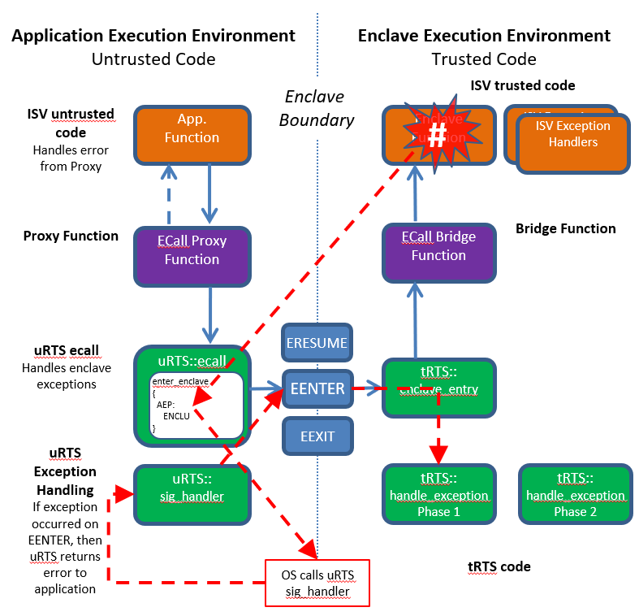
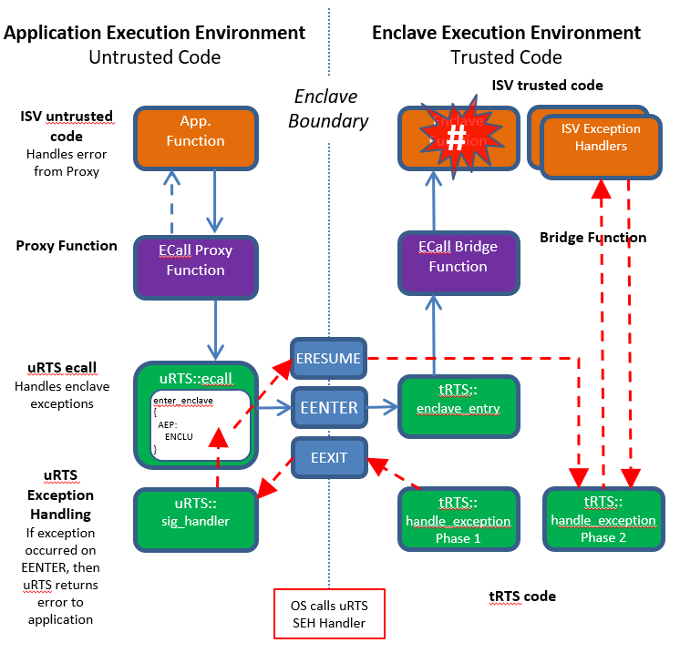

Exception Handling in the Intel(R) SGX SDK
------------------------------------------
The Intel(R) SGX SDK provides the developer a means of registering one or more callback routines within an enclave for the purpose of handling HW exceptions which are directed to the application in the form of a Signal.

For detailed information on how to design an exception handling routine and register/unregister the routine within an enclave, please see the [Intel(R) Software Guard Extensions (Intel(R) SGX) SDK for Linux* OS Developer Reference](https://download.01.org/intel-sgx/sgx-linux/2.9.1/docs/Intel_SGX_Developer_Reference_Linux_2.9.1_Open_Source.pdf) section "Custom Exception Handling".

In addition, the whitepaper [Exception Handling in Intel® Software Guard Extensions (Intel® SGX) Applications](https://software.intel.com/content/www/us/en/develop/download/exception-handling-in-intel-software-guard-extensions-applications.html?wapkw=SGX%20exception) provides an overview of how HW exceptions are handled in Intel(R) Software Guard Extensions (SGX) Enclaves.  Please see this document to understand many facets of what happens when an exception occurs within an SGX enclave including:
* What the HW does for a typical (non-SGX) exception
* Special processing for an SGX exception including:
  * How register state information is arranged and stored in an SGX State Save Area (SSA) when a HW exception or interrupt occurs
  * What exception information is stored within the SSA
  * The synthetic register state that is created by the HW to preserve SGX HW confidentiality
* How software within the enclave can access information which is stored in the SSA on an exception
* How an application may call into an enclave to perform simple processing of a single stage exception handler

The goal of this document is to provide more extensive details into the functional flow of more advanced two stage exception handler which is provided by the Intel(R) SGX Untrusted and Trusted Run-Time Systems.  The two stage exception handler provides a more efficient handler for exceptions and also allows for nested exceptions - exceptions which occur within the ISV Exception Handlers.

## Two Phase Exception Handling

Figure "Linux Exception Handling Flow -1" provides a diagram of the flow for a call into an enclave, referred to as an ECall, when that ECall encounters a hardware exception within a user function.  

Linux Exception Handling Flow - 1

Beginning in the application untrusted code, following the blue control flow line in the diagram, the application will call an Ecall Proxy Function, functions generated via the Edger8r tool, which makes a call to the Untrusted Run-time System (uRTS).  The uRTS has pre-configured a Linux Signal Handler function, uRTS::sig_handler to catch signals sent from the Linux OS as a result of an unhandled HW exception.  A function in the uRTS then issues the EENTER leaf of the ENCLU instruction to enter the enclave.

The enclave is entered in the Trusted Run-time System (tRTS) function encalve_entry.  This function configures the thread to execute within the enclave and then calls the Edger8r generated ECall Bridge Function, which calls into the ISV enclave function.

At some point during the ISV enclave function processing, a HW exception is generated.  The HW stores the thread state away to the first frame State Save Area (SSA) for the active Thread Control Structure's (TCS), then configures a synthetic state for the thread.  The synthetic state sets the RIP to point to the Asynchronous Entry Point (AEP) assigned by the uRTS before issuing EENTER.  This makes the exception look like it has occurred at the address of the AEP (though Page Fault would still point to the page which faulted).  If the exception is not handled by the OS, then the OS will send a signal to the application.  It does this by calling the uRTS::sig_handler function.

The uRTS::sig_handler function must first check to make sure that the exception occurred within the enclave. As described in the whitepaper [Exception Handling in Intel® Software Guard Extensions (Intel® SGX) Applications](https://software.intel.com/content/www/us/en/develop/download/exception-handling-in-intel-software-guard-extensions-applications.html?wapkw=SGX%20exception), an exception within an enclave will result in a synthetic register state with the following conditions:
* RIP will point to AEP address
* Register RAX will contain the value of ERESUME leaf
* Register RBX will contain a pointer to the TCS structure 

The sig_handler function will test the first two conditions to determine that the exception occurred within the enclave.  The first two conditions are actually not sufficient to prove that the exception occurred within the enclave because an exception occurring on the ENCLU::ERESUME instruction will look the same as an exception which occurs within the enclave.  However, if an exception has occurred on ENCLU::ERESUME, then this will be revealed with another exception in subsequent processing.  If the exception occurred within the enclave, then the sig_handler function makes a special ECall back into the enclave to handle the exception.  This ECall is the first phase of the two phase exception handling approach.

Phase 1 of the exception handling is performed within the tRTS::handle_exception function.  This function first checks the current SSA frame (this is the State Save Area which was just stored on the exception) to ensure that there is valid exception information stored within the SSA's ExceptionInfo structure (See [Exception Handling in Intel® Software
Guard Extensions (Intel® SGX)
Applications](https://software.intel.com/content/www/us/en/develop/download/exception-handling-in-intel-software-guard-extensions-applications.html?wapkw=SGX%20exception) for a description of the ExitInfo structure).  If there is not any information stored within the ExitInfo structure, then the Asynchronous Exit from the enclave resulted from a non-supported exception or potentially an interrupt (an OS could be hacked to generate a signal on an interrupt).  In this case, the exception cannot be handled within the enclave and an error is returned from the Phase 1 handler.  

If there is a valid exception within the SSA's ExitInfo structure, then the Phase 1 Handler has a choice of handling the exception or passing it to the Phase 2 Handler.  In a few cases, such as Stack Expansion which is supported in SGX2 enclaves, the Phase 1 handler will complete the exception.  However, in most cases, the Phase 1 handler will defer the exception.  It does this by:
* Storing the ExitInfo structure and General Purpose Registers (GPR) from the SSA frame to the stack and advancing the stack pointer on the SSA Frame GPR to account for the stack usage.
* Configuring the SSA Frame to call into the Phase 2 handler when returning from the enclave on ERESUME.  This is done by setting the SSA GPR RIP to the address of the Phase 2 Handler function and configuring other registers in the SSA Frame GPR to point to parameters of the Phase 2 Exception Handler function.
* Clearing the SSA Frame ExitInfo structure to prevent the Phase 1 Handler from being executed again on this specific exception.  Running the Phase 1 Handler twice on a single exception could compromise the security of the enclave.

After the Phase 2 Handler is configured, the Phase 1 Handler then returns a successful status from the ECall via the EEXIT instruction.

Linux Exception Handling Flow - 2

Linux Exception Handling Flow - 2 details the return from from the Phase 1 Handler back to the uRTS::sig_handler function.  If the Phase 1 Handler reports success, then the uRTS::sig_handler function returns and the original instruction, in this case the instruction at the AEP or the ENCLU::ERESUME, is reissued.  Because the SSA within the enclave has been modified, the ERESUME does not reissue the original enclave instruction which faulted, but instead enters the tRTS Phase 2 handler.

The Phase 2 handler will begin to call ISV Exception Handler functions which have been registered using the sgx_register_exception_handler function (see [Intel(R) Software Guard Extensions (Intel(R) SGX) SDK for Linux* OS Developer Reference](https://download.01.org/intel-sgx/sgx-linux/2.9.1/docs/Intel_SGX_Developer_Reference_Linux_2.9.1_Open_Source.pdf) section "Custom Exception Handling" for a description of how to use this function) passing in the thread context, including register and exception info, saved from the SSA Frame.   A registered exception handler function should return EXCEPTION_CONTINUE_SEARCH (0) if the function does not handle the exception.  In this case, the Phase 2 handler calls the next registered exception handler function.  If the exception is handled, then it should return EXCEPTION_CONTINUE_EXECUTION (-1).  In this case, the Phase 2 handler will restore the register context, which may have been modified by an ISV Exception Handler, and return to the Instruction Pointer of the register context - the exception handling is now complete and the thread resumes processing.

If none of the ISV Exception Handler functions succeeds in handling the exception, then the Phase 2 handler will set a flag for the thread indicating that an exception was not handled.  Then it will restore the register context so that the thread reissues the faulting instruction.  This will cause another fault which will result in the full exception handling sequence starting from the beginning, except, this time, the Phase 1 handler will see the flag, set the enclave state to ENCLAVE_CRASHED, which prevents any further exception handling or ECalls, and return an error to the uRTS::sig_handler.  The uRTS::sig_handler will unwind the ECall and report the error that the enclave crashed back to the original calling function. 